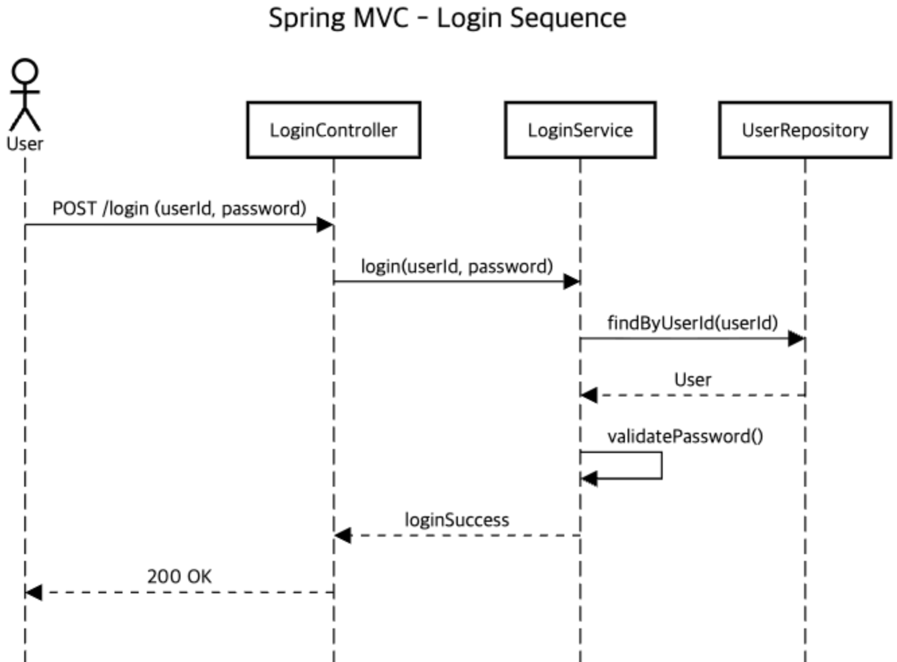
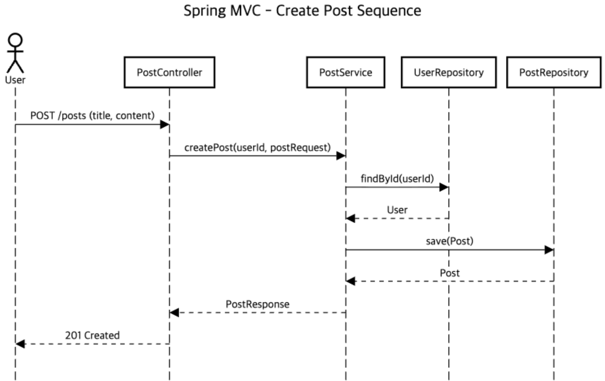
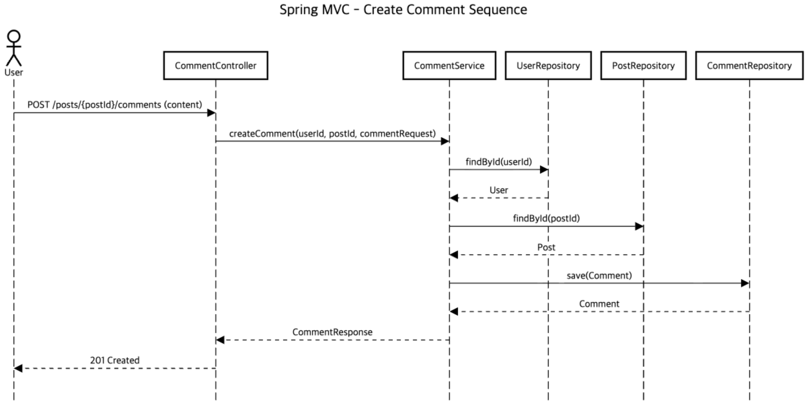

# 소개
Spring MVC 구조 학습 레포지입니다.
간단한 게시판 CRUD 기능을 MVC 구조를 적용하여 구현.

# 기능

1. 로그인
2. 게시글 CRUD
3. 댓글 CRUD

# ERD

</img>

> User
1. id - PK
2. user_id
3. password
4. nickname
5. created_at

> Post
1. id - PK
2. user_id - FK, User.id
3. title
4. content
5. created_at

> Comment
1. id - PK
2. post_id - FK, Post.id
3. user_id - FK, User.id
4. content
5. created_at

- OneToMany
  - user - post, post - comment, user - comment

# Sequence Diagram

- 시퀀스 다이어그램은 서비스의 전체 로직을 보여주는게 아닌, 각 기능별(유스케이스 별)로 나눠서 설명. 
- 시퀀스 다이어그램은 요청 1건이 처리되는 동안
  `Actor → Controller → Service → Repository` 로 책임이 이동하는 흐름을 표현한다.
  (DB는 Repository가 추상화하므로 별도로 표현하지 않는다.)

## Login Sequence
- 로그인 요청 1건이 처리되는 과정

</img>

## Post Sequence
- 게시글 등록 1건이 처리되는 과정

</img>

## Comment Sequence
- 댓글 등록 1건이 처리되는 과정

</img>

# Test Strategy

본 프로젝트는 MVC 구조의 책임 분리를 학습하는 것을 목표로 하며,
각 계층의 역할에 맞는 테스트 전략 적용.

- Controller
  - MockMvc를 사용한 단위 테스트
  - 요청/응답 흐름과 파라미터 바인딩 검증
  - 비즈니스 로직과 DB 접근은 테스트하지 않음

- Service
  - 비즈니스 로직 중심의 단위 테스트
  - Repository는 Mock 객체로 대체
  - 정상 케이스 및 예외 케이스 검증

- Repository
  - @DataJpaTest 기반 통합 테스트
  - 실제 DB와의 연동 및 쿼리 동작 검증

- Authentication
  - 인증 로직은 Interceptor에서 처리
  - Interceptor 단위 테스트를 통해
    로그인 여부에 따른 요청 차단/허용을 검증

| Layer        | Test Type     | Description |
|-------------|---------------|-------------|
| Controller  | Unit Test     | Request/Response 검증 |
| Service     | Unit Test     | 비즈니스 로직 검증 |
| Repository  | Integration   | DB 연동 검증 |
| Interceptor | Unit Test     | 인증 처리 검증 |

# 진행 방향

유스 케이스(Use Case)별로 작성.
1. 기능 작성 (컨트롤러 + API)
2. 그에 대한 요청 및 응답 구조 작성 (DTO)
3. DTO에 맞는 엔티티 작성

# 진행 사항

- Login
- User CRUD
  - create(회원 가입 / 완료)
  - read(회원 정보 조회)
  - update(회원 정보 수정)
  - delete(회원 정보 삭제)

# else
위에서 다루지 않은, 추가 내용들에 대한 설명입니다.

## Tech Stack
- Java 17
- Spring MVC
- Spring JDBC / JPA
- MySQL
- Gradle

## Authentication & Authorization
- 인증(Authentication)은 Interceptor에서 처리
- 권한(Authorization)은 Service 계층에서 처리
